# KK Images

KK Images is a free online service for photographers who want to showcase their works. There are no restrictions on the photographer's skills to register and post their works. Non photographers can also register to the site and follow the photographers. They can like and leave comments to the works posted by the photographers.

This platform also can be used to share photography experiences, techniques, looking for a photographer and general discussions. The registered photographers on this site can be contacted when they leave an email address in their profile page.

Click [here](https://kkimages.herokuapp.com/) to access the frontend of the live site.

Click [here](https://kkimages-drf-api.herokuapp.com/) to access the backend of the live site.

*Screenshot - Mockup on KKImages App, generated from [Multi Device Website Mockup Generator](https://techsini.com/multi-mockup/index.php)*

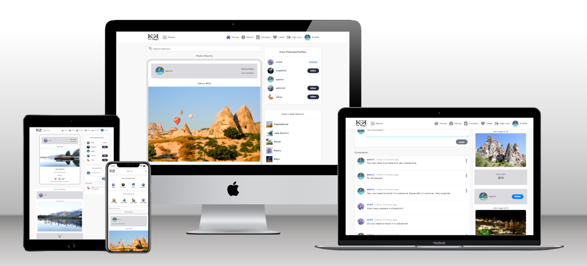

---
## Table of Contents
* [Objectives](#objectives)
    * [Application Goals](#application-goals)
    * [User Goals](#user-goals)
* [Application Design](#application-design)
    * [Initial Database Design](#initial-database-design)
    * [Design Approach](#design-approach)
        * [User Stories](#user-stories)
        * [Kanban Board](#kanban-board)
* [Project Requirements](#project-requirements)
* [Features](#features)
    * [Application Environment Setup](#application-environment-setup)
    * [Profiles app](#profiles-app)
    * [Albums app](#albums-app)
    * [Photos app](#photos-app)
    * [Comments app](#comments-app)
    * [Likes app](#likes-app)
    * [Followers app](#followers-app)
    * [Contacts app](#contacts-app)
* [Future Features](#future-features)
* [PEP8 Checker](#pep8-checker)
* [Testing](#testing)
    * [Automated Testing](#automated-testing)
    * [Manual Testing](#manual-testing)
* [Bugs](#bugs)
* [Deployment](#deployment)
    * [Initial Deployment Settings](#initial-deployment-settings)
    * [Final Deployment Settings](#final-deployment-settings)
    * [Deploy to Heroku](#deploy-to-heroku)
* [Tools](#tools)
* [Credits](#credits)
* [Acknowledgment](#acknowledgment)

---
## Objectives

The main objective of this site is to provide a platform for photographers to showcase their works online. The frontend and backend of this site has been built separately and use React and Django Rest Framework for the frontend to access the backend API.

The target audients are split into photographers and general users.

* Photographers – create and maintain photo albums
* General user – view photo albums, follow photographers, like and leave comments to photo albums

*[Back to Contents](#table-of-contents)*

### Application Goals

* Create a community for photographers to share their works and potentially get hired to commission a job
* A platform that allows hobbyists to browse and get inspirations from the works posted by the photographers
* A platform that allows user to find and hire a photographer
* A platform to share expriences, photography techinques and general discussions.

### User Goals

* Any users can view posts on the site.
* Signup to create albums with photos.
* Registered users can maintain their personal profile and albums.
* Registered users can leave comments, like albums and follow other users.

*[Back to Contents](#table-of-contents)*

---
## Application Design

This part of the project is to design the backend database to provide and store data for the application. As mentioned in the objectives, the backend will be built using Django Rest Framework.

### Initial Database Design

The models of the database design have been adapted and modified from the Code Institute Django Rest Framework API Moment project.

There are 8 tables - User, Profile, Album, Photo, Comment, Like, Follower and Contact.

*Database Design*
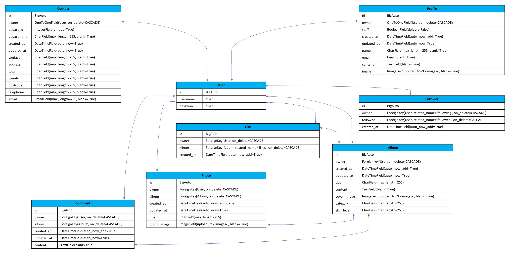

### Design Approach

The development approach on this project is based on the Principles of Agile and use the common agile practices.

The design has broken down into User Stories and grouped into Epics. Each User Story has been allocated its priority, story point and set acceptance criteria and tasks. Timeboxing approach will be used to process the product backlog.

#### User Stories

There are 16 user stories identified for the backend at the beginning of the project and they were grouped into 5 Epics as listed in the table below

**[User Stories Full Detailed Report (Click to view)](readme/user-stories/user-stories.md#user-stories)**

*Summary of Epics and User Stories*

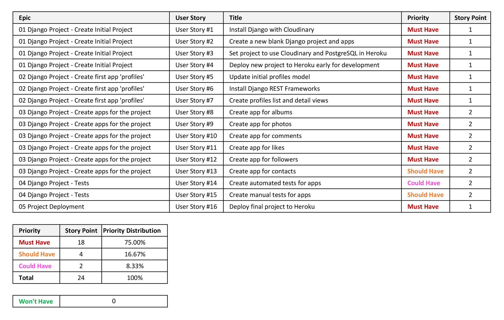

#### Kanban Board

In development, Kanban Board was used to schedule the execution of the user stories. This approach allows to allocating user stories by priority and monitoring each user story's progress.

The Kanban board below shows all the user stories were initially in the 'To Do' list column. Then at different stage of the development, each one is moved into 'In Progress' column and finally into 'Done' column when it has completed. All user stories that are not included in this iteration are moved into 'Out of Current Scope' column.

*Snapshot of the Kanban Board*

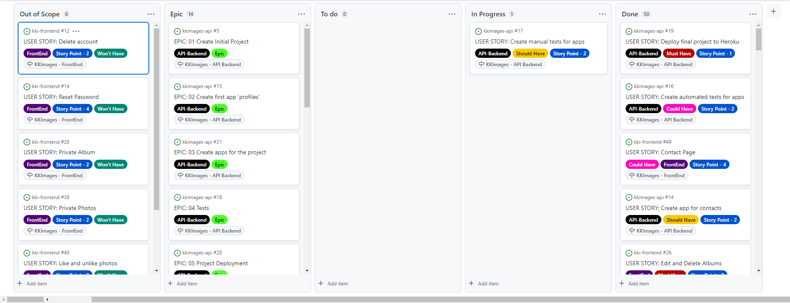

*[Back to Contents](#table-of-contents)*

---
## Project Requirements

This project has been developed using Python Django, Bootstrap and Deployed in Heroku. The following are the project requirements in order to run the application.

* Cloudinary - Online platform to store images for this application
* dj_databases_url - a simple Django utility allows you to utilize the 12factor inspired DATABASE_URL environment variable to configure your Django application
* Django Rest Framework allauth - a set of REST API endpoints to handle User Registration and Authentication tasks.
* Django - a high-level Python web framework
* Django allauth - integrated set of Django applications addressing authentication, registration, account management as well as 3rd party (social) account authentication.
* dj3_cloudinary_storage - Django package that facilitates integration with Cloudinary by implementing Django Storage API.
* Django Filter - use to filter queryset
* Django Rest Framework - a high-level Python web framework
* djangorestframework-simplejwt - a JSON Web Token authentication plugin
* Gunicorn - a Web Server Gateway Interface (WSGI) to run Python web applications
* Psycopg2 - PostgreSQL database adapter for the Python programming language
* Pillow - Image processing
* PostgreSQL - an open source object-relational database system
* Heroku - a platform as a service that enables developers to build, run, and operate applications entirely in the cloud.

*[Back to Contents](#table-of-contents)*

---
## Features

The aim for this part of the project is to develop a backend for the KKImages application to serve the frontend to be developed separately.

Based on the design, this application will be used to serve a community that have an interest in photography. There are 2 main groups of users.

1.	**Registered users**

    The registered and signed in user are allow the following:
    * create new albums and add photos to own album
    * view all albums
    * edit own albums
    * delete own albums
    * like and unlike other user’s albums
    * view all comments
    * edit and delete own comments
    * view user profiles
    * edit own profile
    * follow and unfollow other users

2.	**Non-Registered users**

    The non-registered and signed out user are allow the following:
    * register as a member
    * view all albums but not the album’s photo
    * view album’s comments
    * view user profiles

### Application Environment Setup

From the database design we have 8 tables and they will be developed under Django Rest Framework with Postgres database to 7 separate apps and use Cloudinary to hold the images for this application. Finally, the application will be deployed to Heroku.

To build this application we start with installing the components, setting up the basic environment and deploy to Heroku.

***[User Story #1 - Install Django with Cloudinary](readme/user-stories/api-user-stories-1.jpg)***

***[User Story #2 - Create a new blank Django project and apps](readme/user-stories/api-user-stories-2.jpg)***

***[User Story #3 - Set project to use Cloudinary and PostgreSQL in Heroku](readme/user-stories/api-user-stories-3.jpg)***

***[User Story #4 Deploy new project to Heroku early for development](readme/user-stories/api-user-stories-4.jpg)***

### Profiles app

This app will be linked to the Django User model "owner" and has the following fields. The purpose of this app is to hold the user profile data with image file reference for the profile avatar. It also hold the additional statistic fields on albums and followers.

*Profile model*

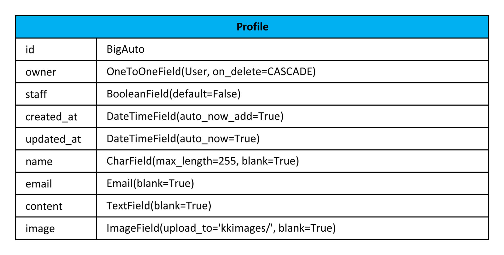

Serialized and additional fields to this model
* is_owner - use for checking current signed in user
* following_id - id for following
* albums_count - use for counting number of albums
* followers_count - use for counting number of followers
* following_count - use for counting number of follows

List View is created with the following:
* Order by creation date in ascending order
* Filter set fields
    - owner__following__followed__profile
    - owner__followed__owner__profile
* Additional ordering fields by
    - albums_count
    - followers_count
    - following_count
    - owner__following__created_at
    - owner__followed__created_at

Detail view created for
* view, edit and delete

***[User Story #5 Update initial profiles model](readme/user-stories/api-user-stories-5.jpg)***

***[User Story #6 Install Django REST Frameworks](readme/user-stories/api-user-stories-6.jpg)***

***[User Story #7 Create profiles list and detail views](readme/user-stories/api-user-stories-7.jpg)***

### Albums app

This app will be linked to the Django User model "owner", Photo model, Comment model and Like model. The purpose of this app is to hold the album data and cover image file reference on Cloudinary. The image file also has a validation to limit the size that can be uploaded to Cloudinary. The limit are less than 2MB and below 4096px x 4096px. Additional serialized and statistic fields will be also available on this model.

*Album model*

Serialized and additional fields to this model
* owner - album's owner
* is_owner - use for checking current signed in user
* profile_id - album's owner profile
* profile_image - album's owner profile image
* like_id - id for like
* likes_count - number of likes to album
* comments_count - number of comments to album
* photos_count - number of photos in album

List View are created with the following:
* To create new album
* Order by last updated and creation date in descending order
* Filter set fields
    - owner__followed__owner__profile
    - likes__owner__profile
    - owner__profile
* Serach Fields
    - owner__username
    - title
    - category_filter
* Additional ordering fields
    - likes_count
    - comments_count
    - photos_count
    - likes__created_at
    - comments__created_at
    - photos__created_at

Detail view created for
* view, edit and delete

***[User Story #8 Create app for albums](readme/user-stories/api-user-stories-8.jpg)***

### Photos app

This app will be linked to the Django User model "owner" and Album model. The purpose of this app is to hold the photo data and photo image file reference on Cloudinary. The image file also has a validation to limit the size that can be uploaded to Cloudinary. The limit is less than 2MB and below 4096px x 4096px. Additional serialized fields will be also available on this model.

*Photo model*

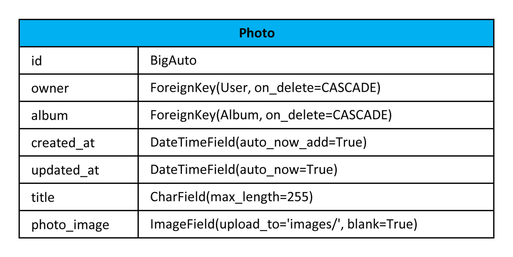

Serialized and additional fields to this model
* owner - photo's owner
* is_owner - use for checking current signed in user
* profile_id - owner's profile id
* profile_image - owner's profile image

List View are created with the following:
* To create new photo
* Order by creation date in descending order
* Filter set fields
    - Album

Detail view created for
* view, edit and delete

***[User Story #9 Create app for photos](readme/user-stories/api-user-stories-9.jpg)***

### Comments app

This app will be linked to the Django User model "owner" and Album model. The purpose of this app is to hold the comments data for each album. Additional serialized fields will be also available on this model.

*Comment model*

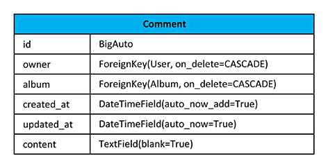

Serialized and additional fields to this model
* owner - comment's owner
* is_owner - use for checking current signed in user
* profile_id - comment owner's profile id
* profile_image - comment owner's profile image
* created_at - creation date
* updated_at - last updated date

List View are created with the following:
* To create new comment
* Order by creation date in descending order
* Filter set fields
    - Album

Detail view created for
* view, edit and delete

***[User Story #10 Create app for comments](readme/user-stories/api-user-stories-10.jpg)***

### Likes app

This app will be linked to the Django User model "owner" and Album model. The purpose of this app is to hold data about user like on album. Additional serialized fields will be also available on this model.

*Like model*

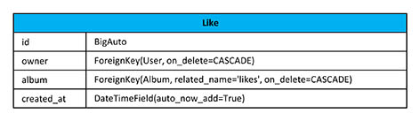

Serialized and additional fields to this model
* owner - like's owner

List View are created with the following:
* To create new like
* Order by creation date in descending order
* Unique from user to album

Detail view created for
* view and delete

***[User Story #11 Create app for likes](readme/user-stories/api-user-stories-11.jpg)***

### Followers app

This app will be linked to the Django User model "owner". The purpose of this app is to hold data about user following or followed by another user. Additional serialized fields will be also available on this model.

*Follower model*

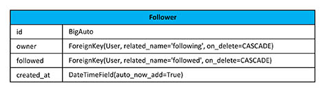

Serialized and additional fields to this model
* owner - following user id
* followed_name - followed user id

List View are created with the following:
* To create new following
* Order by creation date in descending order
* Unique from owner to followed

Detail view created for
* view and delete

***[User Story #12 Create app for followers](readme/user-stories/api-user-stories-12.jpg)***

### Contacts app

This app will be linked to the Django User model "owner". The purpose of this app is to hold data about the contact details. The contact list will be sorted by department id and the company details will always be the first record. Additional serialized fields will be also available on this model.

*Contact model*

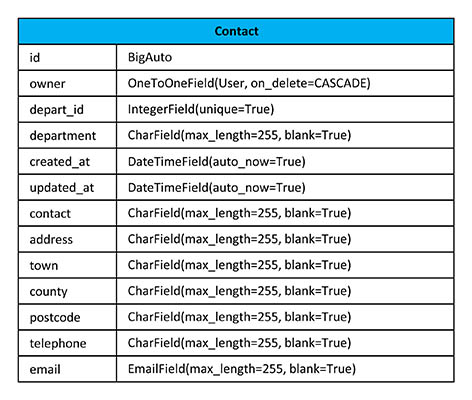

Serialized and additional fields to this model
* owner - owner user id

List View are created with the following:
* To create new following
* Order by department id in ascending order

Detail view created for
* view, edit and delete

***[User Story #13 Create app for contacts](readme/user-stories/api-user-stories-13.jpg)***

*[Back to Contents](#table-of-contents)*

---
## Future Features

This application can be developed further in future with the following addition features:
* Individual photo can be commented
* Individual photo can be edited by the owner
* The contact list can be extended to hold photographer details and allow user to search photographer by location and experiences.

*[Back to Contents](#table-of-contents)*

---
### PEP8 Checker

pep8 is a tool to check Python code against some of the style conventions in PEP 8. Unfortunately, pep8 online checker was not available at the time of this project. Thanks for Code Institute to provide a workaround solution. Followed the instruction from code institute all codes have been passed the checker as show below. 

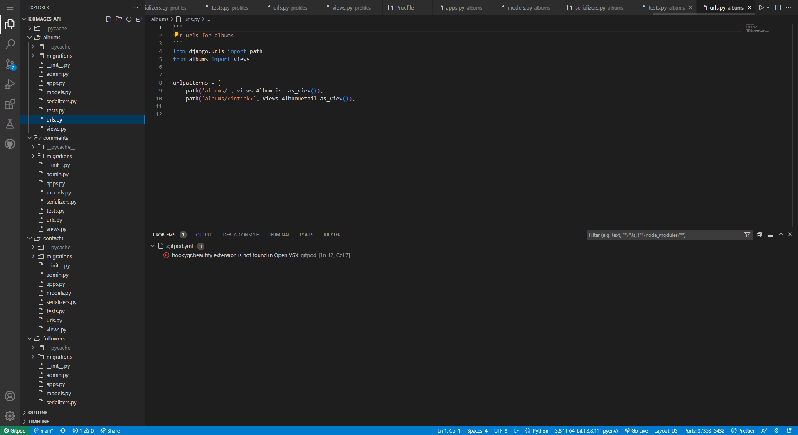

*[Back to Contents](#table-of-contents)*

---
## Testing

Both manual and automated testing have been carried out in the project.

***[User Story #14 Create automated tests for apps](readme/user-stories/api-user-stories-15.jpg)***

***[User Story #15 Create manual tests for apps](readme/user-stories/api-user-stories-15.jpg)***

### Automated Testing

The following are the test cases and the test scripts can be found in the source tests directory in each app:

All test ran successfully.

**1 Test cases for albums**
* Test Case 1: can list albums
* Test Case 2: logged in user can create album
* Test Case 3: logged in user can create album with upload image
* Test Case 4: logged out user can't create album
* Test Case 5: can retrieve album using valid id
* Test Case 6: can't retrieve album using invalid id
* Test Case 7: user can update own album
* Test Case 8: user can't update another user album
* Test Case 9: logged out user can't update album
* Test Case 10: user can delete own album
* Test Case 11: user can't delete another user album
* Test Case 12: logged out user can't delete album
* Test Case 13: user can delete own album and contents

**2 Test cases for comments**
* Test Case 1: can list comments
* Test Case 2: logged in user can create comment
* Test Case 3: logged out user can't create comment
* Test Case 4: can retrieve comment using valid id
* Test Case 5: can't retrieve comment using invalid id
* Test Case 6: user can update own comment
* Test Case 7: user can't update another user comment
* Test Case 8: logged out user can't update comment

**3 Test cases for contacts**
* Test Case 1: can list contacts
* Test Case 2: can retrieve contact using valid id
* Test Case 3: can't retrieve contact using invalid id
* Test Case 4: admin can update contact
* Test Case 5: user can't update admin contacts
* Test Case 6: logged out user can't update contact
* Test Case 7: user can delete own contact
* Test Case 8: user can't delete another user contact
* Test Case 9: logged out user can't delete contact

**4 Test cases for followers**
* Test Case 1: can list followers
* Test Case 2: logged in user can follow
* Test Case 3: logged in user can follow multiple
* Test Case 4: can retrieve followers using valid id
* Test Case 5: can't retrieve followers using invalid id
* Test Case 6: user can unfollow users
* Test Case 7: user can't unfollow another user followers
* Test Case 8: logged out user can't unfollow user

**5 Test cases for likes**
* Test Case 1: can list likes
* Test Case 2: logged in user can create like
* Test Case 3: logged out user can't create like
* Test Case 4: can retrieve like using valid id
* Test Case 5: can't retrieve like using invalid id
* Test Case 6: user can delete own like
* Test Case 7: user can't delete another user like
* Test Case 8: logged out user can't delete like

**6 Test cases for photos**
* Test Case 1: can list photos
* Test Case 2: logged in user can create photo
* Test Case 3: logged out user can't create photo
* Test Case 4: can retrieve photo using valid id
* Test Case 5: can't retrieve photo using invalid id
* Test Case 6: user can update own photo
* Test Case 7: user can't update another user photo
* Test Case 8: logged out user can't update photo
* Test Case 9: user can delete own photo
* Test Case 10: user can't delete another user photo
* Test Case 11: logged out user can't delete photo

**7 Test cases for profiles**
* Test Case 1: can list profiles
* Test Case 2: logged out user can login
* Test Case 3: invalid login
* Test Case 4: can retrieve profile using valid id
* Test Case 5: can't retrieve profile using invalid id
* Test Case 6: user can update own profile
* Test Case 7: user can't update other user profile
* Test Case 8: logged out user can't update profile
* Test Case 9: user can delete own profile
* Test Case 10: user can't delete another user profile
* Test Case 11: logged out user can't delete profile

*Test results for all 68 test cases*

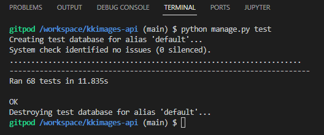

### Manual Testing

The following manual tests have been carried out in the deployed environment to ensure the application is running as expected. The below test reports show all tests have been carried out and passed.

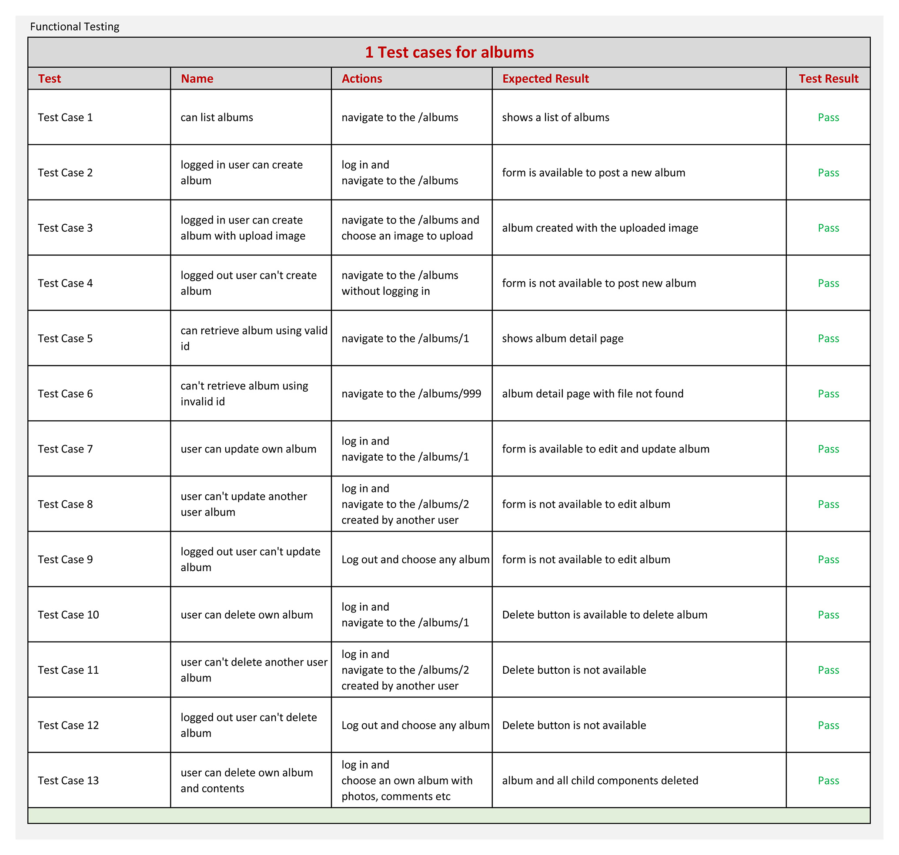
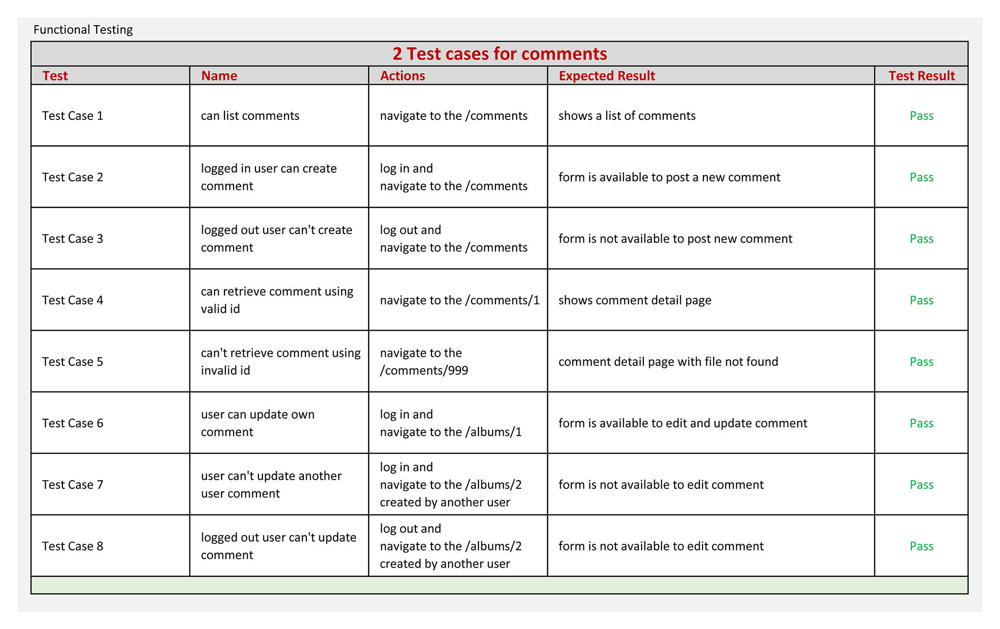
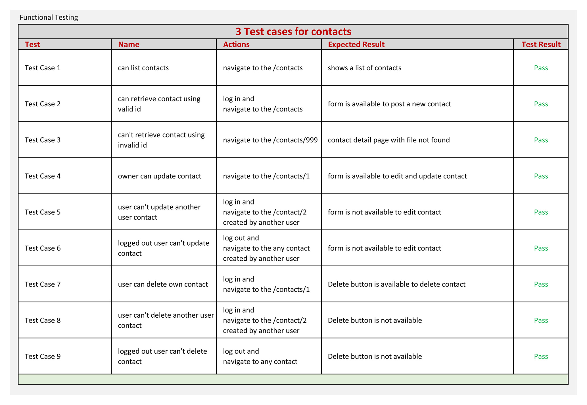
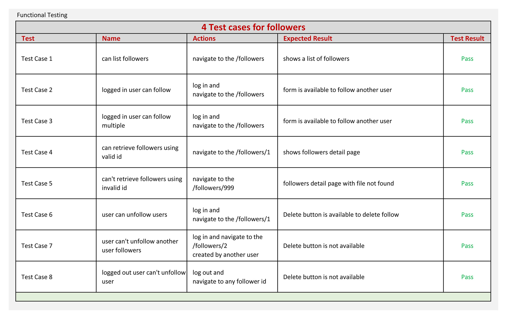
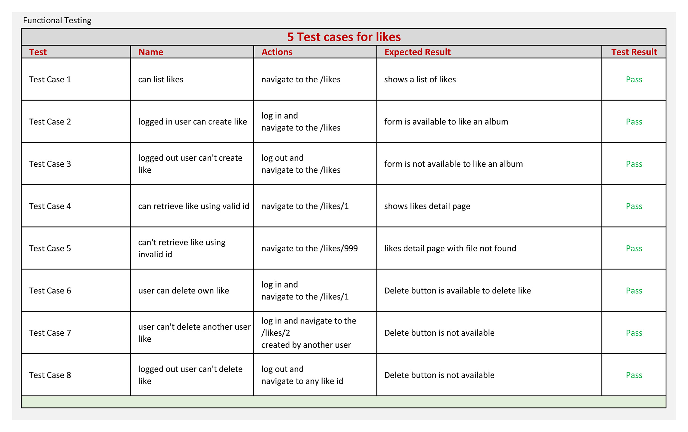
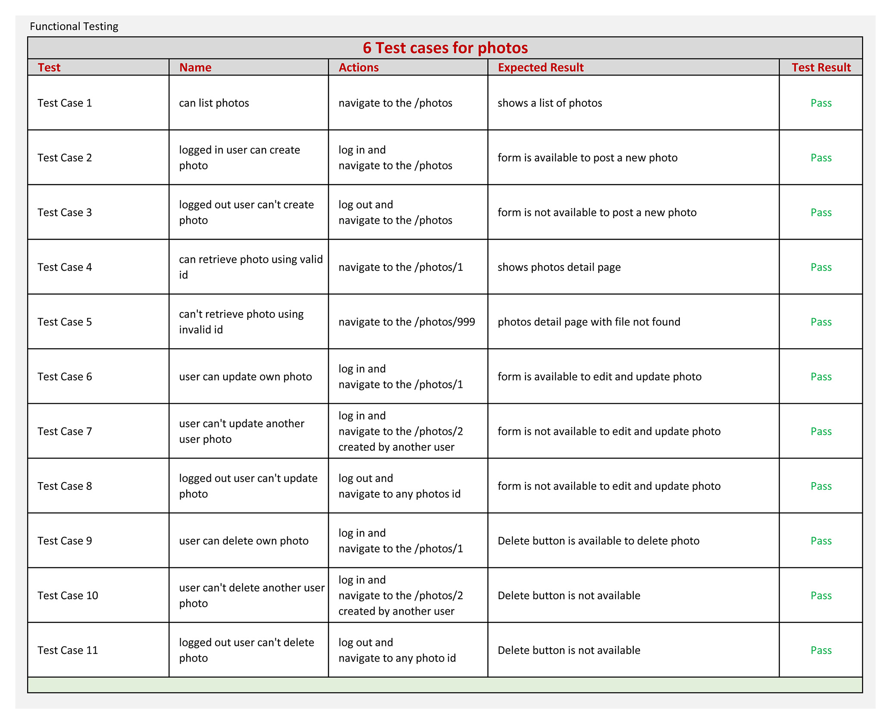
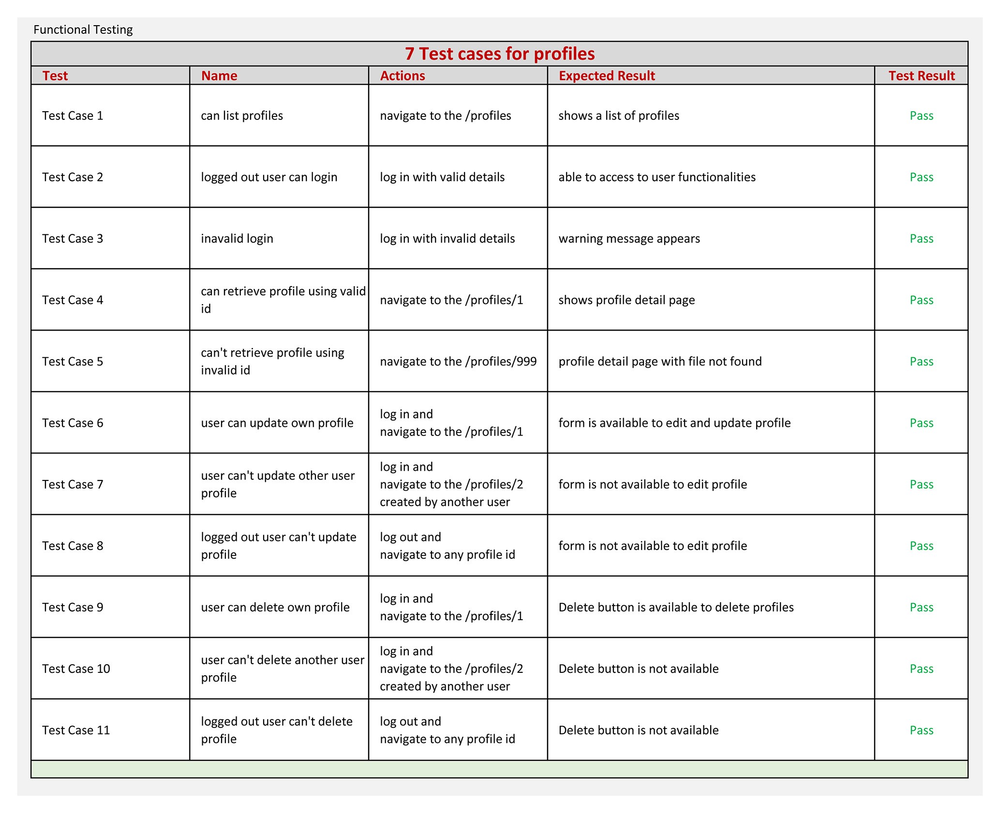

*[Back to Contents](#table-of-contents)*

---
## Bugs

No bugs have been found before deployment.

*[Back to Contents](#table-of-contents)*

---
## Deployment

This is a Django Rest Framework project and deployed in Heroku.

At the beginning of the project, a simple skeleton Django project was deployed to Heroku to ensure the project is connected and running successfully in Heroku.

The final version of code at each phase of the project is then needs to deploy to Heroku so the site is running the latest version of the project.

It is import to check all settings and requirements before deploying the final version to Heroku. This is to ensure all security, debug mode is set correctly and allows the frontend to access to this site.

### Initial Deployment Settings

At the beginning of the project.
* Create a Heroku app with Postgres
* Install Postgres and Gunicorn
* Configure Postgres and Gunicorn in the settings file
* Update secret key in settings file and added in the env file
* Create a Procfile with the following contents
    * release: python manage.py makemigrations && python manage.py migrate
    * web: gunicorn kkimages_api.wsgi

Push code to Github and deploy to heroku as below.

### Final Deployment Settings

The following were carried out before the final application is deploy to Heroku.
* Setup JWT Tokens
* Add the root route to the application
* Set pagination page size in settings
* Add JSON renderer in settings
* Set date and time formatting in settings

The settings file needs to be updated as follows:
* ALLOWED_HOSTS = ['ALLOWED_HOST', 'localhost']
    * ALLOWED_HOST is the Heroku application config variable that referring the host url.
    * In this case “kkimages-drf-api.herokuapp.com”
* Install CORS (pip install django-cors-headers) and add the following:
    * 'corsheaders', in the INSTALLED_APPS section
	* 'corsheaders.middleware.CorsMiddleware', in the MIDDLEWARE list
* Add the following:
	* if 'CLIENT_ORIGIN' in os.environ:
    * CORS_ALLOWED_ORIGINS = [os.environ.get('CLIENT_ORIGIN')]
    * else:
    * CORS_ALLOWED_ORIGIN_REGEXES =
    * [r"^https://.*\.gitpod\.io$",]
    * CORS_ALLOW_CREDENTIALS = True
    * JWT_AUTH_SAMESITE = 'None'

* Replace the following
    * SECRET_KEY = os.environ.get('SECRET_KEY')
    * DEBUG = 'DEV' in os.environ

Make sure the env.py have been setup correctly with following settings:
* os.environ['CLOUDINARY_URL'] = 'fromCloudinaryProfile'
* os.environ["SECRET_KEY"] = 'randomValues'
* os.environ['DEV'] = '1'

Update the requirements file (pip freeze > requirements.txt)

Push the latest code to Github and deploy to heroku.

### Deploy to Heroku
Navigate to config var settings and add the following config vars with correct values.

* ALLOWED_HOST = kkimages-drf-api.herokuapp.com
* CLIENT_ORIGIN = https://kkimages.herokuapp.com
* CLIENT_ORIGIN_DEV = url from development
* CLOUDINARY_URL = from cloudinary profile
* DATABASE_URL = automatically allocated by heroku
* DISABLE_COLLECTSTATIC = 1
* SECRET_KEY = value set in your env.py

In the deploy section, connect github project and manually deploy.

Successfully deploy message will be shown in the log and click open app. It should take you to the root page of the application.

***[User Story #16 Deploy final project to Heroku](readme/user-stories/api-user-stories-16.jpg)***

*[Back to Contents](#table-of-contents)*

---
## Tools

The tools used to carry out the development and deployment on this project are:
* Gitpod and Github
* Python modules
* Django Rest Framework and libraries
* Cloudinary
* Webpage Screenshots - Chrome app extension (FireShot)
* [Lucid Chart](https://www.lucidchart.com/) for creating flow chart
* [PEP8 online checker](http://pep8online.com/) for code validation
* [Heroku](https://id.heroku.com/login) for building, deploying, and managing apps
* [Pixerbay](https://pixabay.com/) for images

*[Back to Contents](#table-of-contents)*

---
## Credits

* This project was inspired and adapted from Code Institute Django Rest Framework Moment project
* [Template](https://github.com/Code-Institute-Org/gitpod-full-template) - created by Code Institute
development framework for the creation of websites and web apps
* [Django Rest Framework](https://www.django-rest-framework.org/) - Home for Django Rest Framework
* [Django Documentation](https://docs.djangoproject.com/en/4.0/) - for research and instructions
* [Django Testing Tutorial - Youtube By The Dumbfounds](https://www.youtube.com/watch?v=qwypH3YvMKc&list=PLbpAWbHbi5rMF2j5n6imm0enrSD9eQUaM&index=1)
* [Code Institute](https://codeinstitute.net/) - Full Stack Framework tutorials

*[Back to Contents](#table-of-contents)*

---
## Acknowledgment

I would like to thank the following to support the development of this site.

* Learning Support - Code Institute
* Mentoring Support - Daisy McGirr