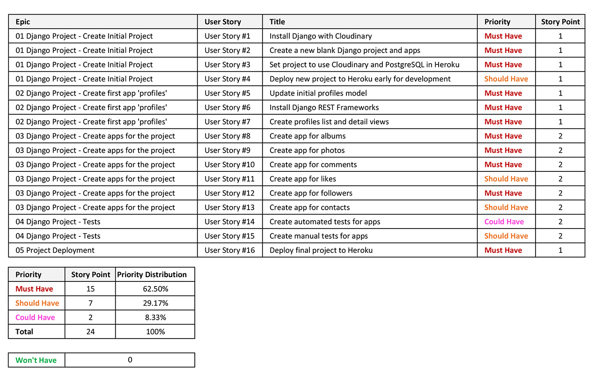

# KK Images

KK Images is a free online service for photographers who want to showcase their works. There are no restrictions on the photographer's skills to register and post their works. Non photographers can also register to the site and follow the photographers. They can like and leave comments to the works posted by the photographers.

This platform also can be used to share photography experiences, techniques, looking for a photographer and general discussions. The registered photographers on this site can be contacted when they leave an email address in their profile page.

Click [here](https://kkimages.herokuapp.com/) to access the frontend of the live site.

*Screenshot - Mockup on KKImages App, generated from [Multi Device Website Mockup Generator](https://techsini.com/multi-mockup/index.php)*

---
### Objectives

The main objective of this site is to provide a platform for photographers to showcase their works online. The frontend and backend of this site has been built separately and use React and Django Rest Framework for the frontend to access the backend API.

The target audients are split into photographers and general users.

* Photographers – create and maintain photo albums
* General user – view photo albums, follow photographers, like and leave comments to photo albums

### Application Goals

* Create a community for photographers to share their works and potentially get hired to commission a job
* A platform that allows hobbyists to browse and get inspirations from the works posted by the photographers
* A platform that allows user to find and hire a photographer
* A platform to share expriences, photography techinques and general discussions.

### User Goals

* Any users can view posts on the site.
* Signup to create albums with photos.
* Registered users can maintain their personal profile and albums.
* Registered users can leave comments, like albums and follow other users.

---
## Application Design

This part of the project is to design the backend database to provide and store data for the application. As mentioned in the objectives, the backend will be built using Django Rest Framework.

### Initial Database Design

The models of the database design have been adapted and modified from the Code Institute Django Rest Framework API Moment project.

There are 8 tables - User, Profile, Album, Photo, Comment, Like, Follower and Contact.

*Database Deisgn*

### Design Approach

The development approach on this project is based on the Principles of Agile and use the common agile practices.

The design has broken down into User Stories and grouped into Epics. Each User Story has been allocated its priority, story point and set acceptance criteria and tasks. Timeboxing approach will be used to process the product backlog.

#### User Stories

There are 16 user stories identified for the backend at the beginning of the project and they were grouped into 5 Epics as listed in the table below

**[User Stories Full Detailed Report (Click to view)](readme/user-stories/user-stories.md#user-stories)**

*Summary of Epics and User Stories*

#### Kanban Board

In development, Kanban Board was used to schedule the execution of the user stories. This approach allows to allocating user stories by priority and monitoring each user story's progress.

The Kanban board below shows all the user stories were initially in the 'To Do' list column. Then at different stage of the development, each one is moved into 'In Progress' column and finally into 'Done' column when it has completed. All user stories that are not included in this iteration are moved into 'Out of Current Scope' column.

*Snapshot of the Kanban Board*

---
## Features

---
## Future Features

---
## Testing

---
## Bugs

---
## Deployment

---
## Tools

---
## Credits

---
## Acknowledgment