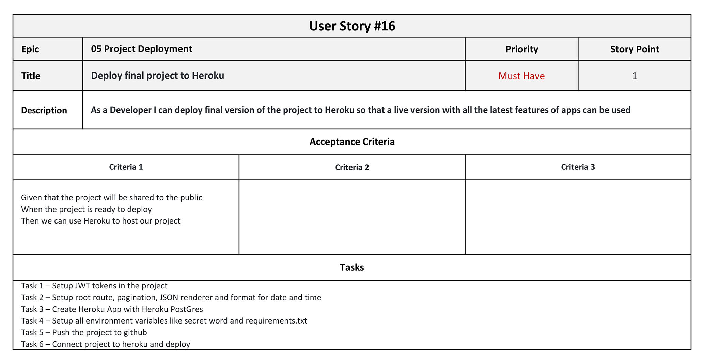

# User Stories

This document list the details of each User Story for the backend of the KKImages project. There are total of 16 User Stories.

Epic 01 Django Project - Create Initial Project

1. [Install Django with Cloudinary](#user-story-1)
2. [Create a new blank Django project and apps](#user-story-2)
3. [Set project to use Cloudinary and PostgreSQL in Heroku](#user-story-3)
4. [Deploy new project to Heroku early for development](#user-story-4)

Epic 02 Django Project - Create first app 'profiles'

5. [Update initial profiles model](#user-story-5)
6. [Install Django REST Frameworks](#user-story-6)
7. [Create profiles list and detail views](#user-story-7)

Epic 03 Django Project - Create apps for the project

8. [Create app for albums](#user-story-8)
9. [Create app for photos](#user-story-9)
10. [Create app for comments](#user-story-10)
11. [Create app for likes](#user-story-11)
12. [Create app for followers](#user-story-12)
13. [Create app for contacts](#user-story-13)

Epic 04 Django Project - Tests

14. [Create automated tests for apps](#user-story-14)
15. [Create manual tests for apps](#user-story-15)

Epic 05 Project Deployment

16. [Deploy final project to Heroku](#user-story-16)

### User Story #1

Return to [Top](#user-stories) of the page or main document [README](/README.md#design-approach)

### User Story #2

Return to [Top](#user-stories) of the page or main document [README](/README.md#design-approach)

### User Story #3

Return to [Top](#user-stories) of the page or main document [README](/README.md#design-approach)

### User Story #4

Return to [Top](#user-stories) of the page or main document [README](/README.md#design-approach)

### User Story #5

Return to [Top](#user-stories) of the page or main document [README](/README.md#design-approach)

### User Story #6

Return to [Top](#user-stories) of the page or main document [README](/README.md#design-approach)

### User Story #7

Return to [Top](#user-stories) of the page or main document [README](/README.md#design-approach)

### User Story #8

Return to [Top](#user-stories) of the page or main document [README](/README.md#design-approach)

### User Story #9

Return to [Top](#user-stories) of the page or main document [README](/README.md#design-approach)

### User Story #10

Return to [Top](#user-stories) of the page or main document [README](/README.md#design-approach)

### User Story #11

Return to [Top](#user-stories) of the page or main document [README](/README.md#design-approach)

### User Story #12

Return to [Top](#user-stories) of the page or main document [README](/README.md#design-approach)

### User Story #13

Return to [Top](#user-stories) of the page or main document [README](/README.md#design-approach)

### User Story #14

Return to [Top](#user-stories) of the page or main document [README](/README.md#design-approach)

### User Story #15

Return to [Top](#user-stories) of the page or main document [README](/README.md#design-approach)

### User Story #16

Return to [Top](#user-stories) of the page or main document [README](/README.md#design-approach)
